# 测试报告

## 流水线控制部件测试

### `pipeline_control`

#### 波形图

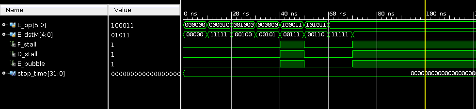

#### 输出

```
time =                    0 op=000000 dstM=00 F_stall=0 D_stall=0 E_bubble=0
time =                   10 op=000010 dstM=1f F_stall=0 D_stall=0 E_bubble=0
time =                   20 op=001000 dstM=04 F_stall=0 D_stall=0 E_bubble=0
time =                   30 op=000000 dstM=05 F_stall=0 D_stall=0 E_bubble=0
time =                   40 op=100011 dstM=07 F_stall=1 D_stall=1 E_bubble=1
time =                   50 op=101011 dstM=06 F_stall=0 D_stall=0 E_bubble=0
time =                   60 op=100011 dstM=1f F_stall=0 D_stall=0 E_bubble=0
time =                   70 op=100011 dstM=0b F_stall=1 D_stall=1 E_bubble=1
```

#### 说明

根据输出可以发现，输出 `F_stall` / `D_stall` / `E_bubble` 仅在 `op` 为 0b100011，且 `dstM` 不等于 0x1f 时，会被设置成 1，在其它条件下均会被设置成 0，0b100011 对应的指令是 `LW` 指令，0x1f 表示空寄存器，所以部件在执行 `LW` 指令，且目的寄存器不为空时，会正确的将相应信号量全部设置成 1，其余条件下设置成 0。波形图的波形变化也恰好反应了相应输入输出的变化，说明该部件的功能是正常的。

## 取指阶段部件测试

### `F_reg`

#### 波形图

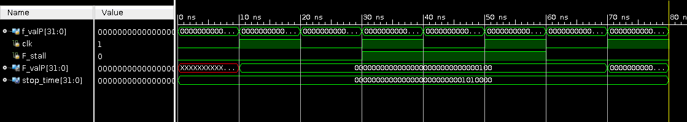

#### 输出

```
time =                    0 F_ValP=         x, F_stall=0, f_valP=         0
time =                   10 F_ValP=         4, F_stall=0, f_valP=         4
time =                   20 F_ValP=         4, F_stall=0, f_valP=         8
time =                   30 F_ValP=         4, F_stall=1, f_valP=        12
time =                   40 F_ValP=         4, F_stall=1, f_valP=        16
time =                   50 F_ValP=         4, F_stall=1, f_valP=        20
time =                   60 F_ValP=         4, F_stall=0, f_valP=        24
time =                   70 F_ValP=        28, F_stall=0, f_valP=        28
```

#### 说明

以 20ns 为一个时钟周期，观察输出和波形图可以看到，在时钟上升沿 10ns、70ns 时，相应的 PC 值均发生了更新，而在 30ns、50ns 时，虽然同样处于时钟上升沿，但由于 `F_stall` 的值为 1，说明取指阶段需要暂停，PC 值不更新。说明部件经过测试正确运行。

### `instr_mem`

#### 波形图

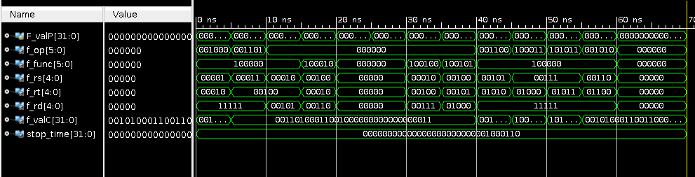

#### 输出

```
inst: 20220001
time =                    0 op=001000 func=100000 rs= 1 rt= 2 rd=31 valC=00000001
inst: 34640003
time =                    5 op=001101 func=100000 rs= 3 rt= 4 rd=31 valC=00000003
inst: 00442820
time =                   10 op=000000 func=100000 rs= 2 rt= 4 rd= 5 valC=00000003
inst: 00823022
time =                   15 op=000000 func=100010 rs= 4 rt= 2 rd= 6 valC=00000003
inst: 00000000
time =                   20 op=000000 func=000000 rs= 0 rt= 0 rd= 0 valC=00000003
inst: 00000000
inst: 00443824
time =                   30 op=000000 func=100100 rs= 2 rt= 4 rd= 7 valC=00000003
inst: 00854025
time =                   35 op=000000 func=100101 rs= 4 rt= 5 rd= 8 valC=00000003
inst: 30aa000c
time =                   40 op=001100 func=100100 rs= 5 rt=10 rd=31 valC=0000000c
inst: ace80001
time =                   45 op=101011 func=100000 rs= 7 rt= 8 rd=31 valC=00000001
inst: 8ceb0001
time =                   50 op=100011 func=100000 rs= 7 rt=11 rd=31 valC=00000001
inst: 28cc0007
time =                   55 op=001010 func=101010 rs= 6 rt=12 rd=31 valC=00000007
inst: 00000000
time =                   60 op=000000 func=000000 rs= 0 rt= 0 rd= 0 valC=00000007
```

#### 说明

当输入的 PC 值发生变化时，可以看到指令存储器部件更新相应 PC 值对应的指令，并更新 `op`、`rs`、`rt`、`rd` 或 `valC` 等寄存器或立即数，通过比较指令预期的寄存器和立即数，与波形图和输出中显示的寄存器和立即数，可以看到指令被正确分解，所以部件正常运行。

### `next_pc`

#### 波形图

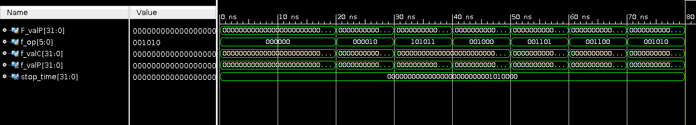

#### 输出

```
time =                    0 op=000000 F_valP=00000000 f_valP=00000004
time =                   20 op=000010 F_valP=00000004 f_valP=00000058
time =                   30 op=101011 F_valP=00000058 f_valP=0000005c
time =                   40 op=001000 F_valP=0000005c f_valP=00000060
time =                   50 op=001101 F_valP=00000060 f_valP=00000064
time =                   60 op=001100 F_valP=00000064 f_valP=00000068
time =                   70 op=001010 F_valP=00000068 f_valP=0000006c
```

#### 说明

观察波形图和输出可以发现，如果当前指令不为 `J` 指令，那么 `f_valP` 在 `F_valP` 的基础上增加 4，如果当前指令为 `J` 指令（`op` 为 000010）那么 `f_valP` 的值将更新成 `f_valC` 的相应值，说明这里实现了指令 PC 的跳转。部件正确地处理了自增 4 和 PC 跳转两种可能的情况，所以部件设计是正确的。

## 译码阶段部件测试

### `D_reg`

#### 波形图

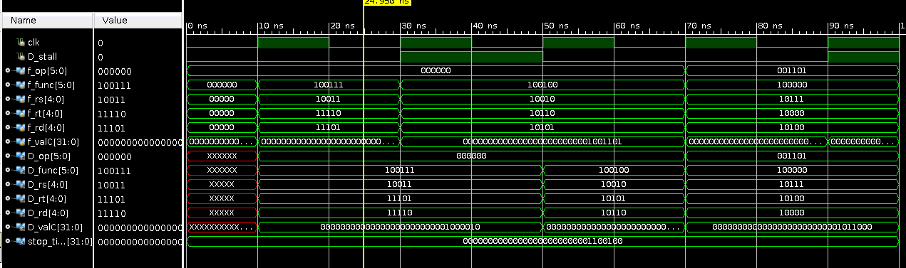

#### 输出

```
time =                    0 op=xxxxxx func=xxxxxx rs= x rt= x rd= x valC=         x
time =                   10 op=000000 func=100111 rs=19 rt=29 rd=30 valC=        66
time =                   50 op=000000 func=100100 rs=18 rt=21 rd=22 valC=        77
time =                   70 op=001101 func=100000 rs=23 rt=20 rd=16 valC=        88
```

#### 说明

以 20ns 为一个时钟周期，观察输出和波形图可以看到，在时钟上升沿 10ns、50ns、70ns 译码阶段流水线寄存器的相应输出都得到了相应更新；而在时钟上升沿 30ns 时，由于 `D_stall` 为 1，说明部件处于暂停阶段，不更新相应值，所以在波形图和输出看到在 50ns 时相应的值仍与之前一致，说明部件设计正确。

### `dstE`

#### 波形图

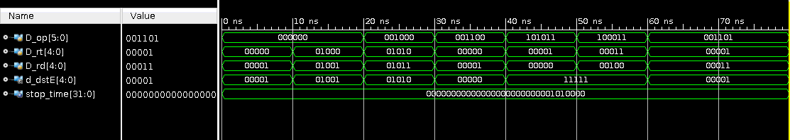

#### 输出

```
time =                    0 op=000000 rt= 0 rd= 1 dstE= 1
time =                   10 op=000000 rt= 8 rd= 9 dstE= 9
time =                   20 op=001000 rt=10 rd=11 dstE=10
time =                   30 op=001100 rt= 0 rd= 1 dstE= 0
time =                   40 op=101011 rt= 1 rd= 0 dstE=31
time =                   50 op=100011 rt= 3 rd= 4 dstE=31
time =                   60 op=001101 rt= 1 rd= 3 dstE= 1
```

#### 说明

观察波形图和输出可以看到，在 0ns、10ns，指令操作为 `ROP`，即寄存器间数进行运算时，相应的目标寄存器为 `rd`；在 20ns、30ns、60ns，指令操作为其它需要目标寄存器的指令时，相应目标寄存器为 `rt`；在 40ns、50ns，相应指令不需要目标寄存器时，相应目标寄存器的值被设置成空寄存器（31），说明部件设计正确。

### `dstM`

#### 波形图

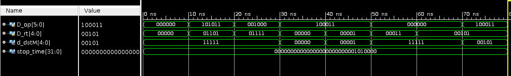

#### 输出

```
time =                    0 op=000000 rt= 0 dstM=31
time =                   10 op=101011 rt=13 dstM=31
time =                   20 op=001000 rt=15 dstM=31
time =                   30 op=100011 rt= 0 dstM= 0
time =                   40 op=100011 rt= 1 dstM= 1
time =                   50 op=000000 rt= 3 dstM=31
time =                   60 op=000000 rt= 5 dstM=31
time =                   70 op=100011 rt= 5 dstM= 5
```

#### 说明

由于仅在 `LW` 指令时，程序需要将内存中读取的数据写入寄存器，所以仅在 `op` 为 100011 时，`dstM` 和 `rt` 一致，其它条件下 `rt` 均被设置成空寄存器（31），所以部件设计正确。

### `srcA`

#### 波形图

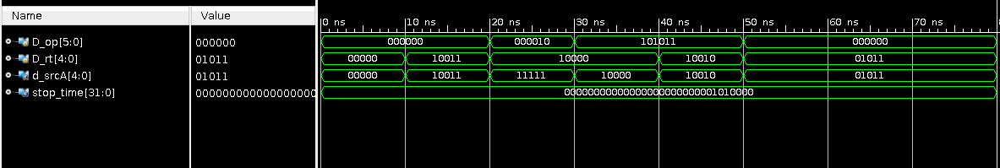

#### 输出

```
time =                    0 op=000000 rt= 0 srcA= 0
time =                   10 op=000000 rt=19 srcA=19
time =                   20 op=000010 rt=16 srcA=31
time =                   30 op=101011 rt=16 srcA=16
time =                   40 op=101011 rt=18 srcA=18
time =                   50 op=000000 rt=11 srcA=11
```

#### 说明

`srcA` 部件对应 `rt` 寄存器，如果指令需要读取 `rt` 寄存器中的相应值时（`op` 为 000000 或 101011），`srcA` 的值会被设置成 `rt` 对应的寄存器；如果指令不需要读取 `rt` 寄存器中的相应值时（其他指令），`srcA` 无需更新。比较波形图和输出的相应结果，说明部件设计正确。

### `srcB`

#### 波形图

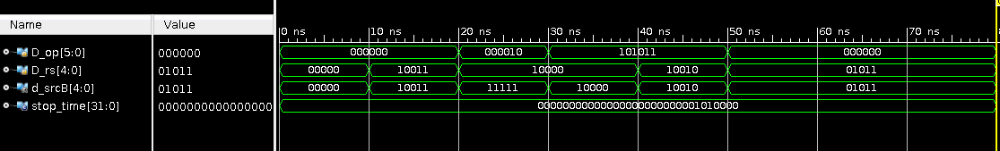

#### 输出

```
time =                    0 op=000000 rs= 0 srcB= 0
time =                   10 op=000000 rs=19 srcB=19
time =                   20 op=000010 rs=16 srcB=31
time =                   30 op=101011 rs=16 srcB=16
time =                   40 op=101011 rs=18 srcB=18
time =                   50 op=000000 rs=11 srcB=11
```

#### 说明

`srcB` 部件对应 `rs` 寄存器，如果指令需要读取 `rs` 寄存器中的相应值时，`srcB` 的值会被设置成 `rs` 对应的寄存器；如果指令不需要读取 `rs` 寄存器中的相应值时（`op` 为 000010），`srcB` 无需更新。比较波形图和输出的相应结果，说明部件设计正确。

### `reg_file`

#### 波形图

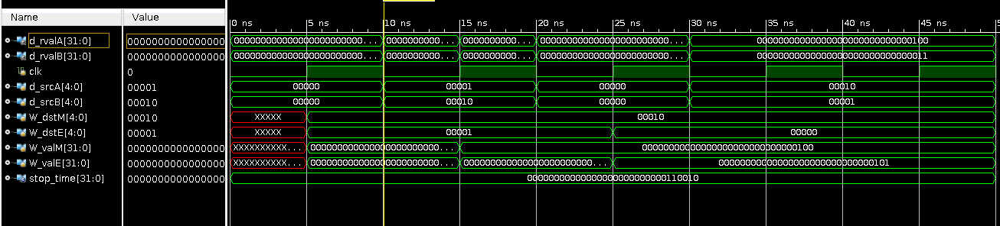

#### 输出

```
time =                    0 srcA= 0 srcB= 0 valA=         0 valB=         0
time =                   10 srcA= 1 srcB= 2 valA=         1 valB=         2
time =                   15 srcA= 1 srcB= 2 valA=         3 valB=         4
time =                   20 srcA= 0 srcB= 0 valA=         0 valB=         0
time =                   30 srcA= 2 srcB= 1 valA=         4 valB=         3
```

#### 说明

测试文件在 5ns 向寄存器部件的 1 寄存器写入值 1，向 2 寄存器写入值 2；在 15ns 的 1 寄存器写入值 3，向 2 寄存器写入值 4；在 25ns 时向 0 寄存器写入值 5。观察输出和波形图可以发现，除了向 0 寄存器写入数据失败之外，其他写入均写入成功，说明寄存器部件设计正确。

### `fwdA`

#### 波形图

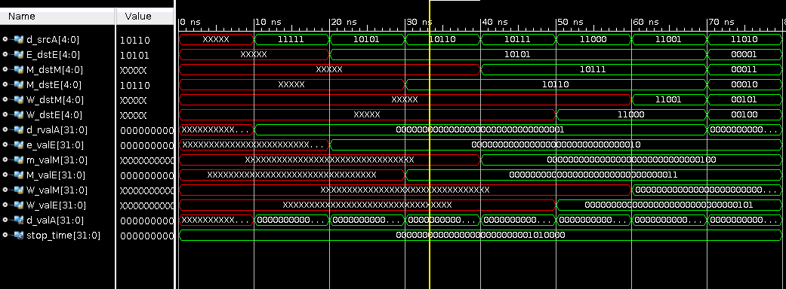

#### 输出

```
time =                    0 valA=         0, srcA=00000
time =                   10 valA=         1, srcA=11111
time =                   20 valA=         2, srcA=10101
time =                   30 valA=         3, srcA=10110
time =                   40 valA=         4, srcA=10111
time =                   50 valA=         5, srcA=11000
time =                   60 valA=         6, srcA=11001
time =                   70 valA=         7, srcA=11010
```

#### 说明

将 `srcA` 依次设置成与 `E_dstE` / `M_dstE` / `M_dstM` / `W_dstE` / `W_dstM` 相同的值，可以从波形图和输出中观察到，相应值依次与 `E_dstE` / `e_valE` / `M_valE` / `m_valM` / `W_valE` / `W_valM` 相同，然后如果 `srcA` 与上述所以值均不相同，输出 `d_rvalA`， 说明部件设计正确。

### `fwdB`

#### 波形图

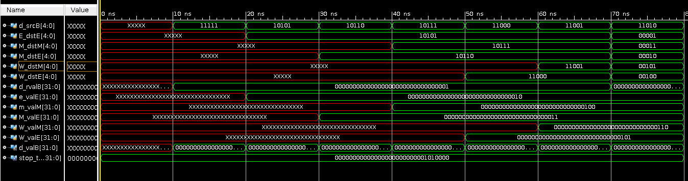

#### 输出

```
time =                    0 valB=         0, srcB=00000
time =                   10 valB=         1, srcB=11111
time =                   20 valB=         2, srcB=10101
time =                   30 valB=         3, srcB=10110
time =                   40 valB=         4, srcB=10111
time =                   50 valB=         5, srcB=11000
time =                   60 valB=         6, srcB=11001
time =                   70 valB=         7, srcB=11010
```

#### 说明

将 `srcB` 依次设置成与 `E_dstE` / `M_dstE` / `M_dstM` / `W_dstE` / `W_dstM` 相同的值，可以从波形图和输出中观察到，相应值依次与 `E_dstE` / `e_valE` / `M_valE` / `m_valM` / `W_valE` / `W_valM` 相同，然后如果 `srcB` 与上述所以值均不相同，输出 `d_rvalB`， 说明部件设计正确。

## 执行阶段部件测试

### `E_reg`

#### 波形图

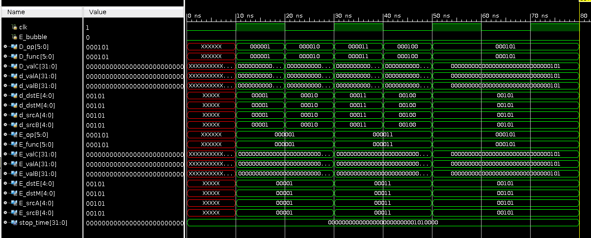

#### 输出

```
time =                    0 E_op=xxxxxx, E_func=xxxxxx, E_valC=         x, E_valA=         x, E_valB=         x, E_dstE=xxxxx, E_dstM=xxxxx, E_srcA=xxxxx, E_srcB=xxxxx
time =                   10 E_op=000001, E_func=000001, E_valC=         1, E_valA=         1, E_valB=         1, E_dstE=00001, E_dstM=00001, E_srcA=00001, E_srcB=00001
time =                   30 E_op=000011, E_func=000011, E_valC=         3, E_valA=         3, E_valB=         3, E_dstE=00011, E_dstM=00011, E_srcA=00011, E_srcB=00011
time =                   50 E_op=000101, E_func=000101, E_valC=         5, E_valA=         5, E_valB=         5, E_dstE=00101, E_dstM=00101, E_srcA=00101, E_srcB=00101
```

#### 说明

观察输出和波形图可以发现，当每个时钟上升沿到来时（10ns，30ns，50ns），部件的输出 `M_op` / `M_valE` / `M_valA` / `M_dstE` / `W_dstM` 均会同步更新成相应的输入 `E_op` / `e_valE` / `E_valM` / `E_dstE` / `E_dstM` 的值，说明部件设计正确。

### `aluA`

#### 波形图

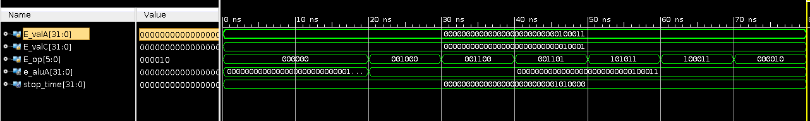

#### 输出

```
time =                    0 op=00 A=00000023 C=00000011 aluA=00000023
time =                   20 op=08 A=00000023 C=00000011 aluA=00000011
time =                   30 op=0c A=00000023 C=00000011 aluA=00000011
time =                   40 op=0d A=00000023 C=00000011 aluA=00000011
time =                   50 op=2b A=00000023 C=00000011 aluA=00000011
time =                   60 op=23 A=00000023 C=00000011 aluA=00000011
time =                   70 op=02 A=00000023 C=00000011 aluA=00000011
```

#### 说明

`aluA` 需要根据指令的不同，需要从 `valA` 和 `valC` 中选取一个值作为 `alu` 的输入。观察波形图和输出可以看到，当对应指令为两个寄存器间运算时（`op` 为 00），相应输入为 `valA`；当对应指令为其它时，相应输入为 `valC`，所以 `aluA` 部件设计正确。

### `aluB`

#### 波形图

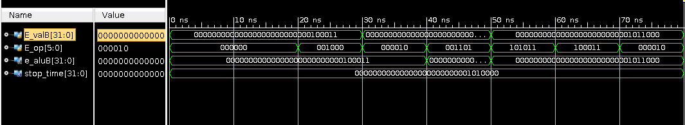

#### 输出

```
time =                    0 op=00 B=00000023 aluB=00000023
time =                   20 op=08 B=00000023 aluB=00000023
time =                   30 op=02 B=0000004d aluB=00000023
time =                   40 op=0d B=0000004d aluB=0000004d
time =                   50 op=2b B=00000058 aluB=00000058
time =                   60 op=23 B=00000058 aluB=00000058
time =                   70 op=02 B=00000058 aluB=00000058
```

#### 说明

`aluB` 部件在需要执行数学运算的指令时，会用 `valB` 更新自己的输出，观察波形图和输出可以看到，除了 `J` 指令（`op` 为 02），其它指令 `aluB` 均等于 `valB`，说明部件正确执行。

### `alufunc`

#### 波形图

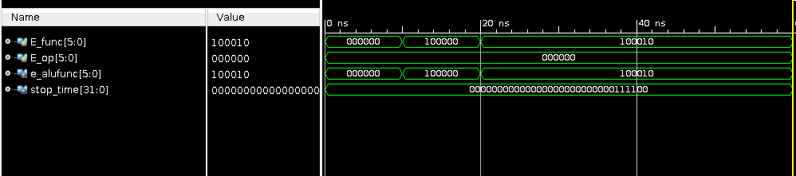

#### 输出

```
time =                    0 op=000000 func=000000 efunc=000000
time =                   10 op=000000 func=100000 efunc=100000
time =                   20 op=000000 func=100010 efunc=100010
```

#### 说明

观察输出和波形图，可以看到在任何时间点，`func` 和 `efunc` 均保持一致，说明部件设计正确。

### `alu`

#### 波形图

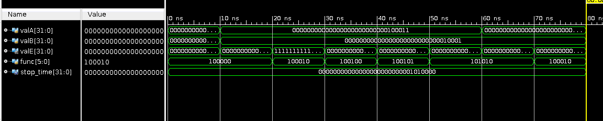

#### 输出

```
time =                    0 A=00000000 B=00000000 func=20 E=00000000
time =                   10 A=00000023 B=00000011 func=20 E=00000034
time =                   20 A=00000023 B=00000011 func=22 E=ffffffee
time =                   30 A=00000023 B=00000011 func=24 E=00000001
time =                   40 A=00000023 B=00000011 func=25 E=00000033
time =                   50 A=00000023 B=00000011 func=2a E=00000001
time =                   60 A=0000000e B=00000011 func=2a E=00000000
time =                   70 A=0000000e B=00000011 func=22 E=00000003
```

#### 说明

在测试中依次对 `alu` 的加减与或比较等操作进行了测试，从输出和波形图中均可以看出 `alu` 部件输出了正确的结果。此外，针对溢出的情况进行了测试，结构表示部件直接忽略溢出的位数，符合设计上的要求，部件设计正确。

## 访存阶段部件测试

### `M_reg`

#### 波形图

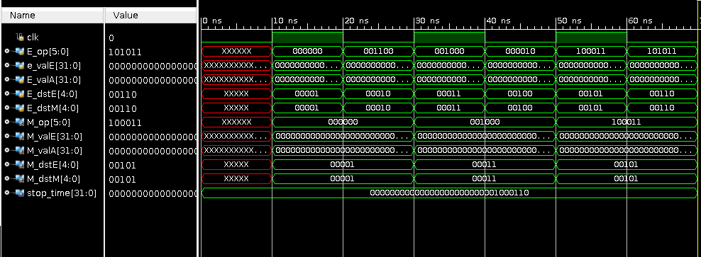

#### 输出

```
time =                    0 M_op=xxxxxx M_valE=xxxxxxxx M_valA=xxxxxxxx M_dstE=xx M_dstM=xx
time =                   10 M_op=000000 M_valE=00000001 M_valA=00000001 M_dstE=01 M_dstM=01
time =                   30 M_op=001000 M_valE=00000003 M_valA=00000003 M_dstE=03 M_dstM=03
time =                   50 M_op=100011 M_valE=00000005 M_valA=00000005 M_dstE=05 M_dstM=05
time =                   70 M_op=001101 M_valE=00000007 M_valA=00000007 M_dstE=07 M_dstM=07
```

#### 说明

观察输出和波形图可以发现，当每个时钟上升沿到来时（10ns，30ns，50ns，70ns），部件的输出 `M_op` / `M_valE` / `M_valA` / `M_dstE` / `W_dstM` 均会同步更新成相应的输入 `E_op` / `e_valE` / `E_valM` / `E_dstE` / `E_dstM` 的值，说明部件设计正确。

### `data_mem`

#### 波形图

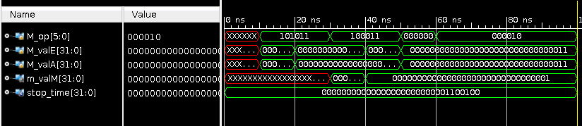

#### 输出

```
time =                    0 valM=xxxxxxxx
time =                   30 valM=00000002
time =                   40 valM=00000001
```

#### 说明

根据测试代码，在 10ns 时，部件将数值 1 写入地址为 1 的内存中；在 20ns 时，部件将数值 2 写入地址为 2 的内存中；在 30ns 时，部件读取地址为 2 的内存；在 40ns 时，部件读取地址为 1 的内存。

```verilog
#10;
M_op = `ISW;
M_valE = 1;
M_valA = 1;
#10;
M_op = `ISW;
M_valE = 2;
M_valA = 2;
#10;
M_op = `ILW;
M_valE = 2;
#10;
M_op = `ILW;
M_valE = 1;
```

观察波形图和输出可以看到，输出在 30ns 时更新成 2，在 40ns 时更新成 1，说明部件正确地从内存中读取了之前写入的值，说明读取和写入都是正确的。

## 写回阶段部件测试

### `W_reg`

#### 波形图

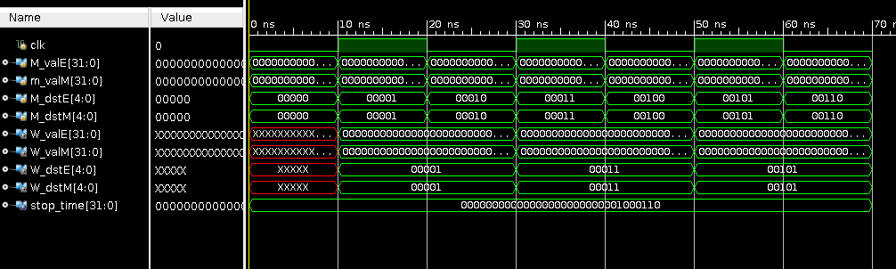

#### 输出

```
time =                    0 W_valE=xxxxxxxx W_valM=xxxxxxxx W_dstE=xx W_dstM=xx
time =                   10 W_valE=00000001 W_valM=00000001 W_dstE=01 W_dstM=01
time =                   30 W_valE=00000003 W_valM=00000003 W_dstE=03 W_dstM=03
time =                   50 W_valE=00000005 W_valM=00000005 W_dstE=05 W_dstM=05
time =                   70 W_valE=00000007 W_valM=00000007 W_dstE=07 W_dstM=07
```

#### 说明

观察输出和波形图可以发现，当每个时钟上升沿到来时，部件的输出 `W_valE` / `W_valM` / `W_dstE` / `W_dstM` 均会同步更新成相应的输入 `M_valE` / `M_valM` / `M_dstE` / `M_dstM` 的值，说明部件设计正确。

## CPU 测试

### 输出

```
regs[0]: 00000000
regs[1]: 00000000
regs[2]: 00000001
regs[3]: 00000000
regs[4]: 00000003
regs[5]: 00000004
regs[6]: 00000002
regs[7]: 00000001
regs[8]: 00000007
regs[9]: 00000001
regs[10]: 00000004
regs[11]: 00000007
regs[12]: 00000001
regs[13]: 00000000
regs[14]: 00000000
regs[15]: 00000000
```

### 测试指令

```
20220001 # addi 1 2 0x1
34640003 # ori 3 4 0x3
00442820 # add 2 4 5
00823022 # sub 4 2 6
08000006 # J 0x6
00000000 # nop
00000000 # nop
00443824 # and 2 4 7
00854025 # or 4 5 8
0085482a # slt 4 5 9
30aa000c # andi 5 10 0xc
ace80001 # sw 7 8 0x1
8ceb0001 # lw 7 11 0x1
28cc0007 # slti 6 12 0x1
00000000 # nop
00000000 # nop
```

### 说明

因为对 CPU 的测试较为复杂，所以分为以下三个测试点：

1. 寄存器的值是否正确
1. PC 的跳转是否正确
1. 气泡和暂停是否正确

在这里，针对寄存器的测试采用寄存器中结果的最终值和预期值相比较来判断 CPU 执行的正确性。
通过最终输出的所有寄存器的值，和每条指令执行完毕后寄存器预期的值相对比，可以发现，针对执行的每一条指令，CPU 都能正常的运作，且相应寄存器的最终值符合预期。

针对跳转和气泡的检测则通过输出中打印的语句来判断：如果发生跳转，则相应语句输出跳转后的 PC 值；如果程序遇到暂停或气泡，则程序输出显示语句。

可以在相应的 log 文件中看到，在跳转指令后，相应 PC 值发生跳转，程序跳转正确。

```
...
PC:        16
...
PC:        24
...
```

在流水线控制器产生相应 `bubble` 信号量后，输出 `need to stop a clk`，说明相应阶段的流水线寄存器正确暂停。

由此，可以认为流水线 CPU 正常工作。

## 备注

本测试报告所有测试结果均基于 **test** 目录下的 **test_*.v** 的 Vivado 模拟生成，相应输出和波形图自相应控制台的输出和对波形图进行截屏。
