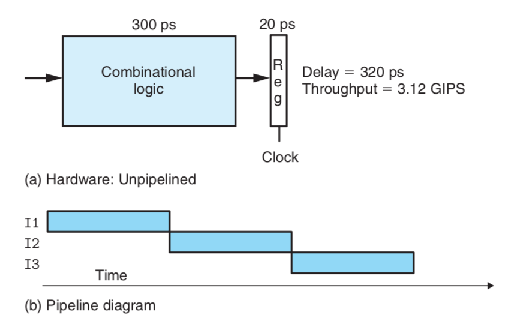
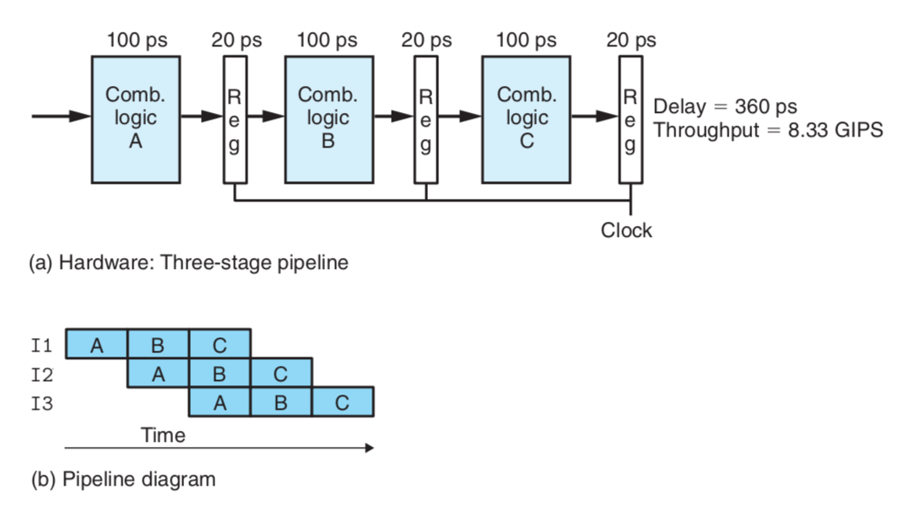
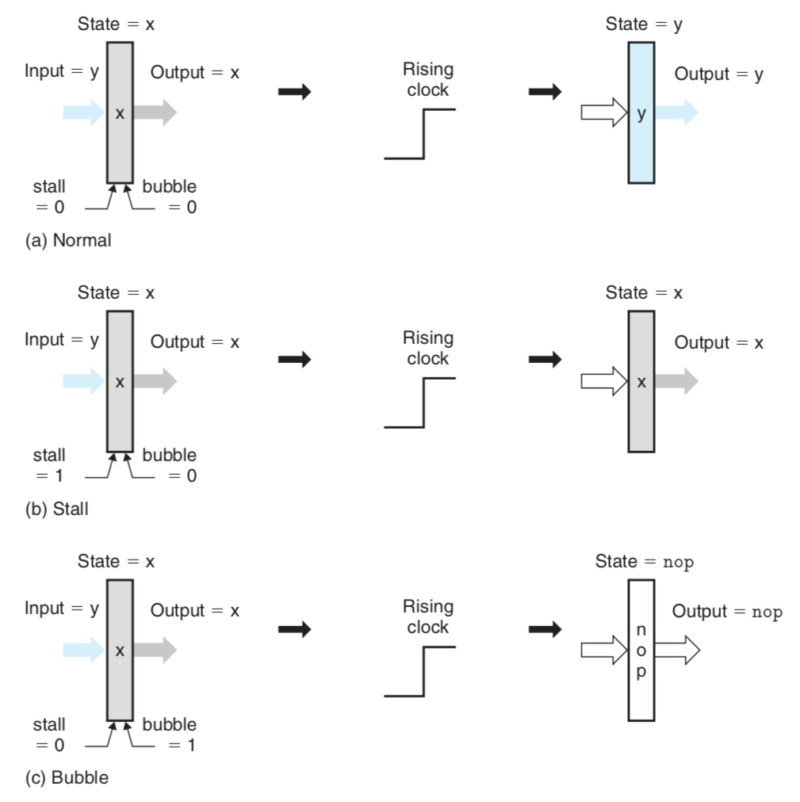
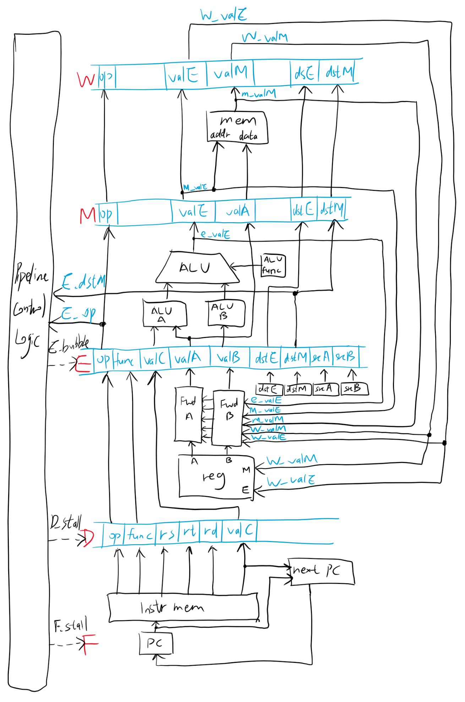

# 设计文档

## 概述

该 CPU 是一个不完全 MIPS 架构（寄存器规模比 MIPS 要求的更小、没有异常处理等）的流水线化 CPU，实现了如下几条最基本的 MIPS 指令：`ADD`，`SUB`，`AND`，`OR`，`SLT`，`ADDI`，`ANDI`，`ORI`，`SLTI`，`SW`，`LW`，`J`，`NOP`。

考虑到使用 Verilog 语言进行实现，在整体设计时进行了较高层次的抽象，即从各部件的功能入手去定义其逻辑行为，而不是直接进行基本数字电路设备的装配。这使得我们可以专注于 CPU 功能的实现与整体架构的优化，同时也提高了源代码的可读性。

## 流水线设计

作为一个流水线化的 CPU，流水线的设计从最开始就决定了 CPU 的整体设计和性能。

### 性能考虑

在传统单周期 CPU 中，所有的指令都按顺序一条一条执行。每条指令执行所需的时间由实现该指令所有部件中的组合逻辑时延加上更新寄存器所需的时钟周期所决定。新的指令必须等待前一条指令完全执行完成后再开始执行，因此对于某些复杂的指令，CPU 中的多数逻辑部件在大多数时间都是闲置的，这限制了 CPU 的吞吐量，如下图所示：

这时，我们考虑把 CPU 指令的执行划分成几个阶段，并在各阶段之间插入流水线寄存器以存储相应阶段所产生的中间数据。这样每条指令都可以在一个时钟周期内通过一个阶段，虽然略微加长了单条指令执行的时延，但其充分利用了 CPU 中的逻辑部件，大幅提高了 CPU 的吞吐量，如下图所示：

综上所述，流水线化的 CPU 以较小的（流水线寄存器造成的）时延代价换取了高吞吐量，因此我们采用流水线设计以提高 CPU 性能。

### 流水线阶段划分

考虑到流水线的时延由最复杂阶段的时延所决定，同时过深的流水线也会导致性能下降，因此我们需要根据所需实现功能的要求将整个 CPU 的流水线划分成几个合适的阶段，这些阶段的复杂度要相对平均，且阶段总数不能太多。这里我们采用了经典的五阶段流水线划分，即将 CPU 对任何一条指令的处理按先后顺序划分为取指、译码、执行、访存和写回。其中，取指阶段 CPU 从指令内存中取出指令并更新 PC；译码阶段 CPU 根据当前指令取出相应寄存器中的值并决定写回操作的目的寄存器；执行阶段 ALU 进行指令所需的算术逻辑运算；访存阶段 CPU 对数据内存进行需要的读写操作；写回阶段 CPU 将前面阶段中得到的数据写回相应的寄存器。这五个阶段涵盖了我们所需实现的所有指令的需求。

### 流水线冒险处理

在流水线化的 CPU 中，后一条指令在前一条指令未执行完成前就开始被执行，如果相邻的若干条指令之间存在关联，那么会出现问题，即所谓的流水线冒险。在我们所需实现的指令当中，由于存在着对寄存器和内存进行读写的指令，如 `ADDI`，`SW` 等，因此可能会产生数据冒险，即当后面的指令读取前面的指令所要写的寄存器或内存的值时，这些值还没有被更新，因此后面的指令会得到错误的值。这时我们考虑两种可能的解决方案，第一种是在出现数据冒险时简单地暂停后续指令的执行直到它们所需的值被正确地更新为止，这相当于在互相关联的指令之间插入足够多的 `NOP` 指令，它对 CPU 执行指令的正确性不产生影响，但在存在大量互相关联指令的条件下会造成显著的吞吐量下降，因此不到万不得已我们不会采取这一方案；另一种较优的方案是转发，即将流水线各阶段中前面的指令产生的正确值在需要的时候直接转发给后续指令，这需要在 CPU 中增加额外的逻辑部件，但性能是最好的，因此在遇到数据冒险时我们优先考虑转发。

为了实现上述暂停和转发机制，我们需要在 CPU 中加入一个全局的流水线控制器，它的作用是检查当前 CPU 中可能出现的冒险并向相应的流水线寄存器发送暂停或冒泡信号。流水线寄存器在收到这些信号后的行为如下图所示：

### 最终设计

经过上述的阶段划分和冒险处理，我们根据所需实现指令的要求对各阶段进行了更进一步的部件划分，力求以尽可能少的部件和简单的设计实现各指令所需的功能，最终流水线设计如下图：

其中蓝色框为流水线寄存器（由于不实现复杂的条件跳转指令，因此这里将 PC 寄存器视为取指阶段的流水线寄存器），黑框为普通寄存器和组合逻辑部件（由于忽略了内存时钟，因此这里将内存也视为组合逻辑）；实线箭头为数据流（其中有蓝色变量名标注的为跨阶段数据流），虚线箭头为控制流。

需要指出的是，该图是 CPU 较高抽象层次的设计图，它清楚地展示了该流水线化 CPU 在各阶段所需的主要部件（关于这些部件的详细功能说明与设计思路参见[部件说明](部件说明.md)）、各阶段之间数据的流动以及流水线的控制逻辑，它略去了各主要部件的内部电路细节以及各阶段内部的一些数据与控制流。

## Verilog 模块化设计

本项目充分利用了 Verilog 的模块化特性以及其类 C 的预处理指令，将 CPU 的各主要部件按模块进行划分为若干个实现代码文件。这些模块之间互不依赖，因此可以简单地为每个模块建立单独的测试以验证其正确性，极大地降低了代码的耦合度与维护成本。最后通过一个 CPU 实现代码文件将这些模块按上述流水线设计连接起来成为一个完整的 CPU，此时该实现文件的内容与上面的流水线最终设计图完全匹配，即其在清晰地展现了流水线化 CPU 宏观结构的同时隐藏了各主要部件的实现细节。这种代码直接体现设计的方式是非常优雅的。

此外，我们不仅做了整体与部分的分离，也做了代码与数据的分离。由于内存（包括指令内存与数据内存）中存储的数据量相对较大，因此在测试时我们并没有直接将这些数据简单地写在测试代码文件中，而是用单独的数据文件进行存放并在测试中动态导入这些数据文件。这使得我们可以更直观灵活地控制各测试中 CPU 的内存环境。
